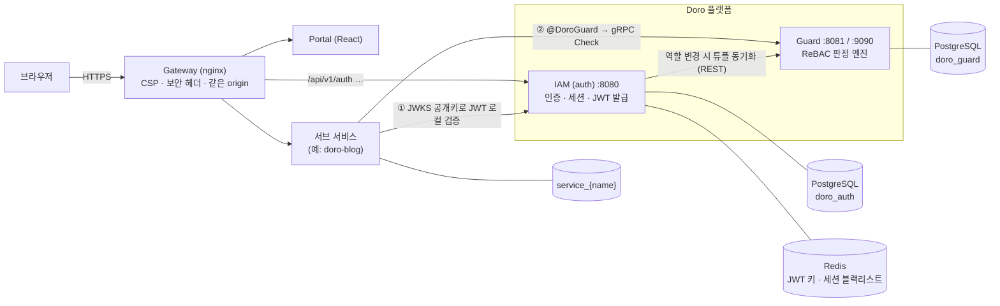
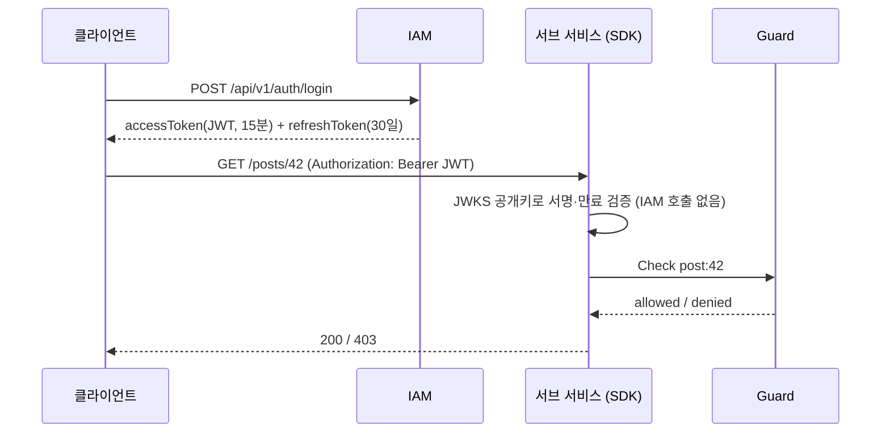
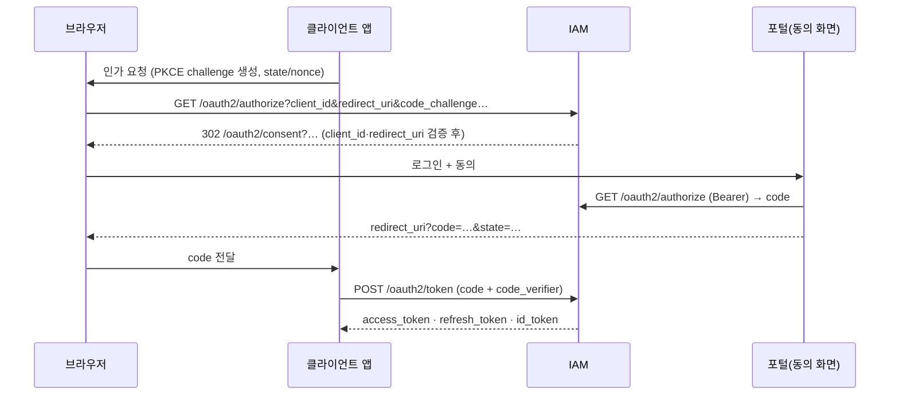

# 🛡️ DORO — 인증(IAM)·인가(Guard) 플랫폼

> **D**istributed **O**rchestration for **R**eBAC & **O**Auth
>
> 여러 마이크로서비스가 **하나의 계정 체계**와 **하나의 권한 엔진**을 공유하도록 만든 인증·인가 인프라입니다.
> 서비스는 로그인·세션·2FA·권한 판정을 직접 만들지 않고, Doro SDK 한 줄로 위임합니다.

이 문서는 **소스 코드를 직접 읽고** 작성했습니다. 구현되지 않았거나 한계가 있는 부분은 숨기지 않고 [알려진 한계](#-알려진-한계와-설계-메모)에 적었습니다.
(이 README는 개요이고, 따라 하기 좋은 예제는 [`docs/USER_GUIDE.md`](docs/USER_GUIDE.md), 연동 시 주의점과 검증 명령은 [`docs/DORO_AGENT_GUIDE.md`](docs/DORO_AGENT_GUIDE.md)에 있습니다. 문서가 코드와 다르면 **코드가 맞습니다.**)

---

## 목차

1. [한눈에 보기](#-한눈에-보기)
2. [아키텍처](#-아키텍처)
3. [Doro IAM — 인증](#-doro-iam--인증-auth)
4. [Doro Guard — 인가](#-doro-guard--인가-guard)
5. [Doro SDK — 서비스 연동](#-doro-sdk--서비스-연동-sdk)
6. [웹 포털과 게이트웨이](#-웹-포털과-게이트웨이)
7. [새 서비스 연동 절차](#-새-서비스-연동-절차)
8. [실행·설정·운영](#-실행설정운영)
9. [보안 모델 요약](#-보안-모델-요약)
10. [알려진 한계와 설계 메모](#-알려진-한계와-설계-메모)
11. [개발·테스트·문서](#-개발테스트문서)

---

## 📌 한눈에 보기

| 구성요소 | 위치 | 역할 | 포트 |
|---|---|---|---|
| **IAM** | [`auth/`](auth) | 가입·로그인·2FA·세션·토큰 발급(JWT/JWKS), 관리자 API | 8080 |
| **Guard** | [`guard/`](guard) | Zanzibar 방식 관계 기반 인가(ReBAC) 엔진 | 8081(REST) · 9090(gRPC) |
| **SDK** | [`sdk/`](sdk) | 서비스용 라이브러리: JWT 로컬 검증, `@DoroGuard`, `@CurrentDoroUser`, Guard 클라이언트 | (라이브러리) |
| **Portal** | [`web/`](web) | 통합 계정 센터(React) | 3000 |
| **Gateway** | [`gateway/`](gateway) | nginx 리버스 프록시: 같은 origin으로 서비스를 묶고 보안 헤더/CSP 부여 | 80/443 |
| **관측성** | [`monitoring/`](monitoring) | Promtail → Loki → Grafana | 3100 · 3001 |

**기술 스택**: Java 25 · Spring Boot 4.1 · PostgreSQL 16 · Redis 7 · gRPC/Protobuf · Flyway · React 19 · Vite · nginx · Docker Compose

**이 플랫폼이 하는 일**
- 계정은 한 곳(IAM)에서 만들고, 모든 서비스가 같은 JWT를 **IAM에 묻지 않고** 로컬에서 검증합니다(JWKS 공개키).
- 권한은 코드의 `if (role == ...)`가 아니라 **관계 튜플**(예: `post:42#author@user:alice`)과 **스키마 규칙**으로 선언하고, Guard가 판정합니다.
- 서비스마다 독립 DB(`service_{name}`)를 쓰고, 인증/인가는 SDK로 위임합니다.

**알아 두면 좋은 점** (오해 방지)
- **SSO(OAuth/OIDC)는 구현되어 있지만 아직 쓰는 서비스는 없습니다.** 지금 doro-blog 같은 서비스는 "인앱 로그인"(같은 IAM API를 같은 origin으로 호출)을 쓰고, 리다이렉트 방식 로그인이 필요한 서비스가 생기면 [OAuth/OIDC](#oauth-21--oidc-sso) 절의 흐름으로 붙입니다. 클라이언트를 등록하기 전까지 OAuth 인가는 동작하지 않습니다.
- 로그아웃/세션 종료의 서브 서비스 반영은 **선택 기능**입니다. SDK의 `revocation-check`를 켜지 않으면 폐기된 액세스 토큰이 만료(기본 15분)까지 유효합니다. [세션과 폐기](#세션과-폐기)를 보세요.

---

## 🏗️ 아키텍처



### 요청 한 번이 지나가는 길



- **서명 검증은 로컬**: SDK가 IAM의 `/.well-known/jwks.json`에서 공개키를 받아 캐시합니다.
- **인가는 Guard로**: `@DoroGuard`가 붙은 메서드만 Guard에 `Check`를 보냅니다.
- **DB는 서비스별 분리**: IAM=`doro_auth`, Guard=`doro_guard`, 서브 서비스=`service_{name}`. Flyway 히스토리 테이블도 분리(`auth_schema_history`, `guard_schema_history`)하고 `ddl-auto: validate`를 유지합니다.

---

## 🔐 Doro IAM — 인증 (`auth/`)

### 계정과 비밀번호
- 비밀번호는 **Argon2id**(솔트 16B, 해시 32B, 메모리 64MB, 반복 3회, 병렬 1)로 저장합니다.
- 가입 입력: `email`, `password`(8~64자), `name`(2~50자). 비밀번호 정책은 길이만 검사합니다.
- 역할은 `USER` / `ADMIN` / `SUPER_ADMIN`. 역할은 JWT 클레임으로 나가지만, **관리자 판정은 Guard로 재검사**합니다(아래 [관리자 인가](#관리자-인가와-guard-동기화)).

### 로그인과 계정 보호

| 보호 장치 | 동작 |
|---|---|
| **계정 잠금** | 비밀번호 5회 연속 실패 → 15분 잠금(`403 ACCOUNT_LOCKED`). 잠금 중에는 올바른 비밀번호도 거부. 실패 카운트는 원자적 UPDATE로 올립니다. |
| **2FA 실패 합산** | TOTP 코드 실패도 같은 카운터에 합산됩니다. |
| **요청 제한(IP 단위)** | 로그인·2FA 로그인 10분당 20회, 계정 조회 10분당 30회, 가입 1시간당 10회. 초과 시 `429` + `Retry-After`. |
| **신뢰 프록시** | 클라이언트 IP는 `trusted-proxies`(기본: 루프백, 도커 브리지)에서 온 `X-Real-IP`만 신뢰하고 `X-Forwarded-For`는 무시합니다. |

### 2단계 인증 (TOTP)
- RFC 6238(HMAC-SHA1, 30초, 6자리, ±1 스텝 허용). 코드 재사용(replay)을 거부합니다.
- **등록은 2단계**: `POST /2fa/setup`이 시크릿을 *대기 슬롯*(`pending_totp_secret`)에 저장 → `POST /2fa/verify`로 유효한 코드를 확인해야 활성화됩니다. 설정만 하고 중단해도 계정이 잠기지 않습니다.
- 2FA가 켜진 계정의 로그인은 `requires2fa:true` + `tempTicket`(5분, 5회 실패 시 폐기) → `POST /2fa/login`.
- 해제(`/2fa/disable`)는 현재 OTP 코드가 필요합니다.

### 토큰

| 항목 | 값 |
|---|---|
| 액세스 토큰 | **JWT RS256**, 기본 **15분**(`DORO_IAM_ACCESS_TOKEN_TTL_SECONDS`, 기본 900) |
| 클레임 | `iss`, `sub`(사용자 UUID), `email`, `sid`(세션 UUID), `uidx`(활성 세션 순번), `role`, `iat`, `exp` — `aud`/`jti`/`nbf` 없음 |
| 헤더 | `kid`(기본 `doro-iam-key-2026-v1`) |
| 리프레시 토큰 | 30일, 불투명 랜덤값(48바이트). **SHA-256 해시만** DB에 저장 |
| 서명 키 | 설정된 PEM → 없으면 Redis의 키쌍 → 없으면 RSA-2048 생성 후 Redis 저장. Redis의 개인키는 `DORO_IAM_JWT_KEY_ENCRYPTION_SECRET`을 설정하면 **AES-256-GCM(PBKDF2 파생)으로 암호화**해 저장합니다(기존 평문 키는 자동 이전, 시크릿이 틀리면 키를 덮어쓰지 않고 기동 중단). 설정하지 않으면 평문 + 기동 시 ERROR 로그 |
| 공개키 | `GET /.well-known/jwks.json`. `n`/`e`는 최소 길이 unsigned 형식(RFC 7518). **키 회전**: `previous-key-id` + `previous-public-key-pem`을 지정하면 이전 공개키를 JWKS에 함께 게시하고 이전 `kid` 토큰도 검증합니다 |

**리프레시 토큰 회전(RTR)**: 갱신할 때마다 새 토큰을 발급하고 이전 토큰은 폐기합니다. 이미 폐기된 토큰이 다시 오면 **재사용 공격으로 판정**해 그 토큰 계열(family)과 세션 전체를 종료하고 `400 TOKEN_REUSE_DETECTED`를 반환합니다. 동시 갱신은 조건부 UPDATE로 직렬화되어 한 요청만 성공합니다. (네트워크 지연을 감안한 유예 시간은 `refresh-reuse-grace-seconds`로 선택 가능, 기본 0.)

### 세션과 폐기
- 로그인마다 `user_sessions` 행이 생기고, 같은 IP+User-Agent의 이전 활성 세션은 **폐기**됩니다(리프레시 토큰 폐기 + 킬스위치 포함).
- 사용자당 활성 세션 수는 `DORO_IAM_SESSION_MAX_ACTIVE_PER_USER`(기본 10, 0 이하는 무제한)로 제한되며, 넘으면 가장 오래된 세션부터 폐기합니다. 세션 만료는 **슬라이딩**입니다: 리프레시할 때마다 마지막 활동 + 30일로 연장됩니다.
- 폐기 경로(로그아웃, 개별 세션 종료, 다른 기기 로그아웃, 비밀번호 변경, 역할 변경, 재사용 감지)는 모두 `SessionRevocationService` 한 곳을 지나며 **DB 상태 + 리프레시 토큰 폐기 + Redis 킬스위치**를 함께 처리합니다.
- 세션 종료 API는 **소유자 검사**를 합니다(남의 세션은 404).
- IAM 자신의 필터는 Redis 세션 블랙리스트를 확인합니다. 서브 서비스는 SDK의 **`doro.iam.revocation-check`**(기본 `OFF`)를 켜면 `GET /api/v1/sessions/current`(DB 기준 세션 상태, 204/401)로 폐기를 즉시 반영합니다. 켜지 않으면 폐기된 액세스 토큰이 만료(기본 15분)까지 유효합니다. 자세한 내용은 [SDK](#-doro-sdk--서비스-연동-sdk)를 보세요.

### 관리자 인가와 Guard 동기화
- 관리자 API는 JWT 역할 + **Guard 재검사**를 함께 요구합니다.
  - `GET /admin/users`: `system:doro#admin`
  - `PATCH /admin/users/{id}/role`: `system:doro#manage_roles` → 성공 시 대상의 모든 세션 종료. 잘못된 역할 값·자기 자신의 역할 변경은 `400`
  - `DELETE /admin/users/{id}/2fa`: `user:{대상}#can_reset_2fa` → 대기 시크릿까지 지우고 대상의 모든 세션 종료
- 가입·역할 변경·기동 시 `UserRelationSyncService`가 역할을 Guard 튜플로 동기화합니다.

  | 역할 | 쓰는 튜플 |
  |---|---|
  | `SUPER_ADMIN` | `system:doro#super_admin@user:{id}`, `user:{id}#super_manager@system:doro#super_admin` |
  | `ADMIN` | `system:doro#admin@user:{id}`, `user:{id}#manager@system:doro#admin`, `user:{id}#super_manager@system:doro#super_admin` |
  | `USER` | `user:{id}#manager@system:doro#admin`, `user:{id}#super_manager@system:doro#super_admin` |

- 첫 관리자를 만드는 부트스트랩 API는 없습니다(DB의 `users.role`을 직접 지정한 뒤 기동 시 동기화).

### OAuth 2.1 / OIDC (SSO)
Doro는 **인가 코드 + PKCE(S256)** 방식의 OAuth 2.1 / OpenID Connect 공급자입니다. 서비스는 비밀번호를 직접 다루지 않고 브라우저를 IAM으로 보냈다가 코드를 받아 토큰으로 교환합니다.



- **클라이언트 등록**: 관리자 API(`POST/GET/DELETE /api/v1/admin/oauth/clients`, ADMIN + Guard `system:doro#admin`)로 `client_id`와 `redirect_uri` 목록(https만, loopback은 http 허용, 와일드카드·fragment·userinfo 불가)을 등록합니다. 모드 `DORO_OAUTH_CLIENT_REGISTRY_MODE`(기본 `WARN`): 등록된 클라이언트는 **자기 URI와 정확히 일치**해야 하고 스코프는 허용 목록의 부분집합이어야 합니다. 미등록 `client_id`는 `ENFORCE`에서 거부, `WARN`에서는 환경 허용 목록(`DORO_OAUTH_ALLOWED_REDIRECT_URIS`)으로 폴백하며 경고를 남깁니다.
- **인가 엔드포인트**: `client_id`/`redirect_uri`를 **먼저** 검증하고 실패하면 절대 리다이렉트하지 않습니다(오픈 리다이렉트 방지). 이후 오류만 검증된 `redirect_uri`로 `error`/`state`와 함께 돌려보냅니다. `Bearer`가 있으면(포털 동의 화면) JSON `{code, state}`를 반환합니다.
- **토큰 엔드포인트**: `application/x-www-form-urlencoded`(RFC 6749 snake_case, RFC 응답·오류 형식, `Cache-Control: no-store`)와 기존 `application/json`(camelCase, `ApiResponse`) 둘 다 받습니다. grant는 `authorization_code`와 **`refresh_token`**(리프레시 회전·재사용 감지, 해당 클라이언트의 세션에만 허용). 인가 코드는 1회용·기본 5분이고 `client_id`·`redirect_uri`·PKCE에 묶이며, 검증 실패 시에도 소비됩니다.
- **OIDC**: `openid` 스코프면 `id_token`(RS256, `aud`=클라이언트, `nonce`, `email`/`name` 등 스코프별 클레임; `picture`는 http(s) URL만), `GET /oauth2/userinfo`, `/.well-known/openid-configuration`.
- **코드 저장소**: Redis(`doro:oauth:code:<sha256>`, 원본 코드는 저장하지 않음)를 쓰고, Redis가 없으면 인메모리로 폴백합니다(`DORO_OAUTH_CODE_STORE=auto|redis|memory`).
- **토큰 격리(중요)**: OAuth로 발급한 액세스 토큰에는 `cid`(클라이언트)가 표시되고 **`role`은 항상 `USER`**입니다(사용자의 관리자 권한이 클라이언트로 넘어가지 않음). 이런 토큰은 IAM에서 `/oauth2/userinfo`와 `/api/v1/sessions/current`에서만 인증으로 인정되고 다른 IAM API(프로필·세션·2FA·관리자)에서는 거부됩니다. OAuth 세션의 **리프레시 토큰도 일반 갱신 엔드포인트(`/api/v1/auth/token/refresh`)에서는 거부**됩니다(회전 전에 확인하므로 정상 클라이언트의 토큰이 소모되지도 않음). 그렇지 않으면 클라이언트가 사용자의 실제 권한이 담긴 일반 로그인 토큰을 받을 수 있습니다. `id_token`(`aud` 있음)은 IAM에서 어떤 API에도, SDK에서는 `doro.iam.audience`를 설정하지 않는 한 액세스 토큰으로 인정되지 않습니다.
- **세션**: OAuth 세션은 클라이언트별로 만들어져 같은 클라이언트의 이전 세션만 교체됩니다. 토큰 엔드포인트와 인증 없는 인가 요청에는 IP 단위 요청 제한이 있습니다.
- **공개 클라이언트 전용**(`token_endpoint_auth_methods_supported: none`)이며, 브라우저 앱이 다른 origin에서 토큰 엔드포인트를 부르려면 `DORO_CORS_ALLOWED_ORIGIN_PATTERNS`에 그 origin을 추가해야 합니다. 게이트웨이의 `/oauth2/consent` 라우트는 `gateway/nginx.conf` 반영이 필요합니다.

### API 요약 (`/api/v1/**`, JSON camelCase)

| 영역 | 엔드포인트 | 인증 |
|---|---|---|
| 가입/조회 | `POST /auth/signup`(201 `{userId}`), `POST /auth/lookup` | 공개 |
| 로그인 | `POST /auth/login` → `{requires2fa, tempTicket?, tokens?}`, `POST /auth/2fa/login` | 공개 |
| 토큰 | `POST /auth/token/refresh` → `TokenResponse` | 공개(리프레시 토큰) |
| 2FA | `POST /auth/2fa/setup`(`{secret, qrUri}`), `/2fa/verify`, `/2fa/disable` | Bearer |
| 로그아웃 | `POST /auth/logout?sessionId=` (생략 시 토큰의 `sid`) | Bearer + 소유자 검사 |
| 내 정보 | `GET`·`PATCH /users/me`, `PUT /users/me/password` | Bearer |
| 세션 | `GET /sessions`, `GET /sessions/current`(204/401), `DELETE /sessions/{id}`, `POST /sessions/revoke-others` | Bearer (+ 소유자 검사) |
| 관리자 | `GET /admin/users`, `PATCH /admin/users/{id}/role`, `DELETE /admin/users/{id}/2fa`, `GET /admin/authz`(204) | ADMIN+ & Guard |
| OAuth/키 | `GET /oauth2/authorize`, `POST /oauth2/token`, `GET /oauth2/userinfo`, `GET /.well-known/{jwks.json,openid-configuration}`, 관리자 `…/admin/oauth/clients` | 위 설명 참고 |

`TokenResponse = {accessToken, refreshToken, tokenType:"Bearer", expiresIn, sessionId, userIndex}`

> `/api/v1/auth/**`는 Spring Security에서 `permitAll`이고, 로그인이 필요한 엔드포인트(로그아웃, 2FA)는 컨트롤러가 직접 검사합니다. 이 경로에 새 엔드포인트를 추가할 때는 인증 검사를 직접 넣어야 합니다.

**응답 형식**
```jsonc
// 성공
{ "success": true, "data": { ... }, "timestamp": "2026-10-02T00:00:00Z" }
// 실패 (success 필드 없음, code 는 enum 이름)
{ "timestamp": "...", "status": 401, "error": "Unauthorized",
  "code": "INVALID_CREDENTIALS", "message": "...", "path": "/api/v1/auth/login",
  "details": [ { "field": "email", "rejectedValue": "...", "reason": "..." } ] }
```
주요 코드: `INVALID_INPUT_VALUE`(400, 검증 실패), `INVALID_TOKEN`·`TOKEN_REUSE_DETECTED`(400), `UNAUTHORIZED`·`INVALID_CREDENTIALS`·`TOKEN_EXPIRED`·`SESSION_EXPIRED`·`INVALID_2FA_CODE`(401), `ACCESS_DENIED`·`ACCOUNT_LOCKED`·`ACCOUNT_SUSPENDED`(403), `USER_NOT_FOUND`·`SESSION_NOT_FOUND`(404), `EMAIL_ALREADY_EXISTS`(409), `TOO_MANY_REQUESTS`(429). 비밀번호·시크릿·토큰·코드 필드는 검증 오류에서도 값이 노출되지 않습니다.

### 데이터 모델
`users`(email 유일, status, role) · `credentials`(해시, TOTP 시크릿/대기 시크릿, 실패 횟수, 잠금 시각) · `user_sessions` · `refresh_tokens`(해시 유일, family/세션 FK).
Flyway: V1 초기 스키마 → V2 프로필 이미지 → V3 역할 → V4 리프레시 해시 유일 인덱스 → V5 대기 TOTP 시크릿.

---

## 🧭 Doro Guard — 인가 (`guard/`)

구글 **Zanzibar** 모델을 줄 단위 DSL과 함께 구현한 관계 기반 인가 엔진입니다. "누가(subject) 무엇(object)에 어떤 관계(relation)인가?"를 **관계 튜플**로 저장하고, 규칙(스키마)에 따라 권한을 계산합니다.

### 핵심 개념

```
  네임스페이스:객체#관계 @ 주체네임스페이스:주체[#주체관계]
  post:42#author@user:alice            ← alice 는 post:42 의 author
  post:42#viewer@group:eng#member      ← group:eng 의 모든 member 는 post:42 의 viewer (userset)
  post:42#series@series:7              ← post:42 는 series:7 에 속함 (TTU 용 연결)
```

- **튜플**: `relation_tuples` 테이블. 키 길이 제한 `namespace/relation 64`, `object_id/subject_id 128`. 쓰기는 **멱등**(`INSERT … ON CONFLICT DO NOTHING`)이고, 같은 배치의 중복은 제거됩니다. 반환값 `writtenCount`는 실제 삽입된 행 수입니다.
- **스키마**: 타입별 릴레이션 규칙. 활성 스키마는 Guard 전체에 **하나**입니다.

### 스키마 DSL

```text
# 전체 줄 주석만 지원 (# 또는 //)
type blog_post {
  relation author: user
  relation series: blog_series
  relation editor: author
  relation viewer: author | editor | series#viewer
}
```

| 규칙 | 설명 |
|---|---|
| 구조 | `type 이름 {` … `}` 안에 `relation 이름: 식`(**한 줄**) |
| `\|` | 합집합. 공백 불필요 |
| `&` | 교집합. **양옆 공백 필수** |
| `-` | 차집합. **양옆 공백 필수**, 우결합(`a - b - c` = `a - (b - c)`) |
| `x#y` | **항상 TTU**: 이 객체의 `x` 튜플이 가리키는 객체에서 `y`를 검사 |
| 선언 순서 | 같은 타입 안에서 **먼저 선언된** 릴레이션만 참조로 인식. 뒤에 선언된 것을 쓰면 항상 false |
| 미지원 | 괄호, `&`와 `\|` 혼용, 줄 끝 주석, 타입 제약 강제(`relation owner: user`의 `user`는 선언일 뿐) |

> 파서는 문법 오류가 아닌 줄(알 수 없는 키워드 등)을 **조용히 무시**합니다. 스키마를 등록한 뒤 의도한 대로 동작하는지 `check`로 확인하세요.

### 판정 알고리즘 (`CheckEngine`)
1. **직접 튜플** 일치 → 즉시 허용. (스키마를 거치지 않으므로 스키마에 없는 타입도 튜플이 있으면 일치합니다.)
2. **userset 전개**: 튜플의 주체가 `group:eng#member`처럼 관계를 가지면 그 그룹의 멤버를 재귀 검사.
3. **스키마 규칙** 평가: 합집합/교집합/차집합, 계산 릴레이션, TTU.
4. 안전장치: 최대 깊이 **32**(`doro.guard.engine.max-depth`), 경로별 방문 집합으로 **순환 차단**. 초과·순환은 해당 가지를 `false`로 취급하고, **차집합의 빼는 쪽이 잘리면 전체를 거부(fail-closed)**, 잘린 결과는 캐시하지 않습니다.
5. 스키마가 없거나 타입/릴레이션이 없으면 **거부**. 예외는 허용으로 이어지지 않습니다.

**`depth`**: 응답의 `depth`는 평가 중 실제로 도달한 최대 재귀 깊이입니다(계산 릴레이션·TTU 한 단계가 각각 1).

**캐시**: Caffeine L1(기본 최대 5만 건·60초 — `DORO_GUARD_CACHE_MAX_SIZE`/`DORO_GUARD_CACHE_TTL_SECONDS`, 0 이하면 캐시 끔. 허용·거부 모두 캐시, 최상위 결과만). 튜플이 실제로 바뀐 경우(커밋 후)와 스키마 변경 시 무효화하고, 평가 도중 무효화가 겹치면 그 결과는 캐시하지 않습니다(세대 카운터). **인스턴스 로컬**이므로 다른 인스턴스에서 튜플이 바뀌면 최대 TTL(60초)만큼 낡을 수 있습니다. 스키마는 `DORO_GUARD_SCHEMA_REFRESH_SECONDS`(기본 30초, 0이면 끔)마다 DB의 활성 버전과 비교해 **더 높은 버전만** 적용하고 캐시를 비웁니다(다른 인스턴스의 등록 반영, 기동 시 DB 오류로 기본 스키마로 폴백했을 때의 복구).

### 스키마 등록은 "전체 교체"입니다
`POST /api/v1/guard/schema`는 보낸 DSL로 활성 스키마를 **통째로 교체**합니다(버전 +1, 이전 버전은 `is_active=false`로 보존). **자기 타입만 보내면 다른 서비스와 IAM의 타입이 사라집니다.** 올바른 절차:

1. `GET /api/v1/guard/schema`로 활성 DSL을 받는다.
2. 자기 타입이 이미 있는지 확인한다.
3. 없으면 `기존 DSL + 내 DSL`을 `POST {"dsl": "..."}`한다. (참조 구현: doro-blog `BlogSchemaInitializer`)

ENFORCE 모드에서는 이 POST에 `schema-write` 권한이 있는 호출자 토큰이 필요합니다(아래). 동시 등록으로 버전이 충돌하면 최대 3회 재시도하고 `409 SCHEMA_CONFLICT`로 알립니다.

**검증 모드** (`DORO_GUARD_VALIDATION_MODE`, 기본 `WARN`): 스키마 등록 시 이해하지 못한 줄(번호 포함)과 선언되지 않은 타입을 가리키는 항(오타·뒤에 선언된 릴레이션 참조)을, 튜플 쓰기 시 스키마에 없는 타입/릴레이션을 검사합니다. `WARN`은 로그만, `ENFORCE`는 거부(`400`), `OFF`는 검사 안 함. 저장된 스키마를 읽어 오는 경로는 항상 관대하게 파싱하므로 기동이 이 검사 때문에 실패하지 않습니다.

### 기본 스키마 (`schema.doro`)
`user`(manager, super_manager, can_reset_2fa) · `group`(member) · `system`(super_admin, admin, auditor, manage_roles) · `folder`(parent, owner, editor, viewer) · `document`(parent, owner, editor, viewer)

### API

**REST** (`/api/v1/guard`, 응답 `{success, data, timestamp}`)

| 메서드·경로 | 요청 | `data` |
|---|---|---|
| `POST /check` | `{namespace, objectId, relation, subjectNamespace, subjectId, subjectRelation?}` | `{allowed, depth, reason}` |
| `POST /tuples` | 튜플 배열 | `{writtenCount}` |
| `DELETE /tuples` | 튜플 배열(본문 있는 DELETE) | `{deletedCount}` |
| `GET /schema` | — | 활성 DSL 문자열 |
| `POST /schema` | `{"dsl": "..."}` | `{version, dsl, active}` |

**gRPC** (`doro.guard.v1.GuardService`, 9090, 평문): `Check`, `WriteTuples`, `DeleteTuples`, `Expand`. 서비스 SDK는 gRPC를 사용합니다. 잘못된 입력(빈 값·길이 초과)은 `INVALID_ARGUMENT`입니다.

**Expand**: `object#relation`에 접근할 수 있는 주체를 트리로 돌려줍니다(`tree_json`). 노드는 `{object, type(leaf/union/intersection/difference/computed/ttu), subjects[], children[]}`이고, 직접 튜플의 주체는 `subjects`에, userset·계산 릴레이션·TTU는 `children`으로 전개됩니다. 최대 깊이와 경로별 순환 방지, 노드 상한(`DORO_GUARD_EXPAND_MAX_NODES`, 기본 5000)이 있으며 잘리면 루트에 `"truncated":true`가 붙습니다.

### 서비스 인증 (호출자 토큰)
Guard에는 사용자 로그인이 없고, **호출하는 서비스**를 `X-Doro-Service-Token` 헤더(gRPC는 같은 이름의 메타데이터)로 식별합니다.

| 모드 (`DORO_GUARD_SECURITY_MODE`) | 동작 |
|---|---|
| `OFF` (기본) | 검사하지 않음 |
| `WARN` | 잘못된/없는 토큰을 경고 로그로만 남기고 통과 (전환 점검용) |
| `ENFORCE` | 잘못된/없는 토큰은 `401`(gRPC `UNAUTHENTICATED`) |

- **호출자별 토큰**: `DORO_GUARD_SERVICE_TOKENS=auth:<토큰>,blog:<토큰>:schema-write` (토큰 32자 이상, 이름 `[a-z][a-z0-9-]{0,31}`, `shared` 예약). 형식 오류·짧은 토큰·중복·알 수 없는 권한은 **기동 시점에 실패**합니다. 하나가 유출돼도 그 호출자 것만 교체하면 됩니다.
- **권한(scope)**: 현재 `schema-write` 하나. `POST/PUT/DELETE /schema`는 이 권한이 있는 호출자만(없으면 `403`). 스키마 조회·체크·튜플 API에는 필요 없습니다. 운영에서는 스키마를 등록하는 blog만 갖고 auth는 갖지 않습니다.
- **공유 토큰**(`DORO_GUARD_SERVICE_TOKEN`): 전환용 호환 수단이며 모든 권한을 가집니다. 호출자별 토큰이 설정된 뒤 공유 토큰 사용은 경고 로그로 남아, 정리 시점을 판단할 수 있습니다.
- 토큰 비교는 상수 시간이고, 오류 메시지·로그에 토큰 값은 남지 않습니다.
- 마이그레이션 도구: [`scripts/split-guard-tokens.sh`](scripts/split-guard-tokens.sh)(`--check/--apply/--scopes/--finalize/--rollback`, 실패 시 자동 복구), [`scripts/set-guard-mode.sh`](scripts/set-guard-mode.sh).

> Guard의 REST(8081)·gRPC(9090)는 **절대 외부에 노출하지 마세요.** compose는 기본으로 `127.0.0.1`에만 바인딩하고, 게이트웨이도 Guard를 프록시하지 않습니다.

### 데이터 모델·마이그레이션
`relation_tuples`(forward/reverse 인덱스, 직접 튜플용 **부분 유니크 인덱스** `uq_relation_tuple_direct`) · `schema_definitions`(version 유일, `is_active`)
Flyway: V1 초기 → V2 완전 중복 튜플 정리(백업 테이블로 이동) → V3 직접 튜플 부분 유니크 인덱스(PostgreSQL 전용 `db/vendor/postgresql`).

---

## 🧩 Doro SDK — 서비스 연동 (`sdk/`)

서브 서비스가 인증·인가를 위임받기 위한 Spring Boot 자동 구성 라이브러리입니다. **Spring Security와 무관하게** 동작합니다(SDK는 `SecurityContext`를 채우지 않으므로 Security 스타터를 함께 쓰지 않는 것을 권장).

### 의존성 (아직 저장소에 배포되지 않음)
SDK는 공개 저장소에 배포되지 않았고, 다른 저장소에서는 Gradle **composite build 치환**으로 씁니다.
```groovy
// settings.gradle
includeBuild('../Doro') {
    dependencySubstitution { substitute module('com.hunnit-beasts:doro-sdk') using project(':sdk') }
}
// build.gradle
implementation 'com.hunnit-beasts:doro-sdk'
// 필수: Java 25 툴체인, Spring Boot 4.1.x, 컴파일 옵션 -parameters (SpEL 에서 파라미터 이름 사용)
```

### 설정
```yaml
doro:
  iam:
    jwks-uri: http://auth-api:8080/.well-known/jwks.json   # 기본 http://localhost:8080/...
    issuer: https://auth.doro.local
    issuer-validation: OFF          # OFF | WARN | ENFORCE  (iss 검증)
    cookie-name: ""                 # 비어 있으면 쿠키를 읽지 않음
    clock-skew-seconds: 5
    audience: ""                   # 비어 있지 않으면 aud 클레임에 이 값이 없는 토큰 거부
    jwks-prefetch: true             # 시작 시 JWKS 백그라운드 사전 조회
    revocation-check: OFF           # OFF | WARN | ENFORCE — 로그아웃/세션 종료를 즉시 반영 (IAM 호출)
    revocation-cache-seconds: 30
    revocation-timeout-millis: 2000
    revocation-fail-open: true
    revocation-failure-backoff-seconds: 10
  guard:
    grpc-host: guard-api            # 기본 localhost
    grpc-port: 9090
    enabled: true
    service-token: ${DORO_GUARD_SERVICE_TOKEN:}   # Guard 가 WARN/ENFORCE 일 때 필요
```

### 사용
```java
@PostMapping("/posts/{postId}")
@DoroGuard("blog_post:#postId#editor")                 // 단축형: 네임스페이스:객체SpEL#릴레이션
public PostResponse update(@PathVariable Long postId, @CurrentDoroUser DoroUser user, ...) { ... }

@DoroGuard(namespace = "blog_post", object = "#req.postId", relation = "viewer")   // 속성형, 중첩 DTO 가능
@DoroGuard(namespace = "doc", object = "#id", relation = "viewer", subject = "#targetUserId") // 대리 검사
```
- `#`로 시작하는 표현식만 SpEL로 평가하고 나머지는 리터럴입니다. 변수: 파라미터 이름, `#p0/#a0`, `#args`.
- 클래스 레벨 `@DoroGuard`도 가능하고, 메서드 레벨이 우선합니다.
- `@CurrentDoroUser`는 `DoroUser`, `UUID`, `String`을 지원합니다. 비로그인이면 `DoroUser`는 `anonymous`, **`UUID`/`String`은 `null`**입니다.
- 튜플은 `DoroGuardClient`로 씁니다: `writeTuple`/`deleteTuple`(실패 시 `0` 반환), **`writeTupleOrThrow`/`deleteTupleOrThrow`**(실패 시 예외), `check`(실패 시 `false`), `checkOrThrow`, `expand`(실패 시 `null`)/`expandOrThrow`.

### 동작 보장과 비보장 — 꼭 읽어 주세요

| 항목 | 동작 |
|---|---|
| JWT 검증 | RS256 고정, `exp` 필수, `kid`로 키 선택, 시계 오차 허용. `iss`는 `issuer-validation`에 따라 검증. **`aud`가 있는 토큰(OIDC id_token 등)은 `doro.iam.audience`를 설정하지 않으면 액세스 토큰으로 인정하지 않고**, 설정하면 그 값이 `aud`에 있어야 함 |
| 세션 폐기 확인 | 기본 꺼짐(`revocation-check: OFF`). `WARN`/`ENFORCE`면 검증된 토큰의 세션을 IAM `GET /api/v1/sessions/current`로 확인("유효" 30초 캐시, "폐기"는 토큰 만료까지 캐시, 같은 세션 동시 조회는 호출 1회로 합침). 폐기면 `ENFORCE`는 익명 처리, `WARN`은 로그만. IAM 장애는 기본 fail-open이고, 한 번 실패하면 `revocation-failure-backoff-seconds`(기본 10초) 동안은 IAM을 다시 부르지 않습니다 |
| **필터는 요청을 막지 않음** | 토큰이 없거나 틀려도 **익명으로 통과**합니다. 인증 강제는 `@DoroGuard` 또는 컨트롤러의 `isAuthenticated()` 확인으로 해야 합니다. |
| 기본 예외 처리 | `DoroAccessDeniedException` → 비로그인 `401 UNAUTHORIZED` / 로그인 `403 ACCESS_DENIED`, Guard 장애(`checkOrThrow`) → `503 GUARD_UNAVAILABLE`. 본문은 `{success:false, code, message, status}`. 서비스가 자체 핸들러를 정의하면 그것이 우선합니다. |
| Fail-closed | Guard가 응답하지 않으면 `check`는 `false`(거부)입니다. `@DoroGuard` 경로에서는 이것이 403으로 나타납니다(503 아님). 호출당 3초 데드라인, 재시도 없음. |
| JWKS 캐시 | 시작 시 백그라운드로 미리 가져오고(`doro.iam.jwks-prefetch`), 10분 TTL 갱신은 **요청을 막지 않고 백그라운드**로 합니다. 미지의 `kid`는 30초 쿨다운으로 동기 재조회. JWKS에서 사라진 `kid`는 성공한 조회 뒤에 캐시에서 제거되고, 조회 실패·빈 JWKS는 기존 키를 유지합니다. |
| 스레드 | 사용자 정보는 `ThreadLocal`이라 비동기 스레드로 전파되지 않습니다. |
| 전송 | Guard와의 gRPC는 평문(TLS 없음) — 신뢰할 수 있는 내부 네트워크에서만 사용 |

---

## 🌐 웹 포털과 게이트웨이

### 포털 (`web/`, React 19 · Vite · zustand · Tailwind)
- 로그인(이메일 → 비밀번호 → TOTP 3단계), 가입, **내 계정**(정보 수정, 비밀번호 변경, 2FA 설정/해제, 세션 목록·원격 종료, 앱 목록), **관리자 탭**(사용자 목록, 역할 변경, 2FA 초기화), OAuth 동의 화면, 관리자 전용 로그 뷰어(Loki, 검색어는 LogQL 이스케이프). 관리자 런처의 Swagger 링크는 `VITE_GUARD_DOCS_URL`/`VITE_IAM_DOCS_URL`이 설정된 경우에만 표시됩니다.
- **여러 계정 전환은 클라이언트 전용**입니다(서버 API 없음). 토큰은 `localStorage`에 계정별로 저장되고, "모든 계정에서 로그아웃"은 저장된 **모든 계정의 서버 세션**을 각자의 토큰으로 종료합니다. OAuth 동의 요청은 로그인 화면을 거쳐도 유지됩니다(검증된 파라미터만, 10분).
- 401을 받으면 리프레시 토큰으로 한 번 갱신합니다. 갱신 결과를 `refreshed / rejected / unavailable`로 구분해 **서버가 거부(400/401/403/404)한 경우에만** 로그아웃하고, 네트워크 오류·5xx에서는 로그인을 유지합니다. 여러 탭의 동시 갱신은 Web Locks로 직렬화합니다.

### 게이트웨이 (`gateway/nginx.conf`)
- 모든 서비스를 **같은 origin(443)**으로 묶습니다: IAM(`/api/v1/auth`, `/sessions`, `/admin/users`, `/admin/oauth/`, `/oauth2`, `/.well-known`), 포털, 블로그, 메뉴 등. OAuth 동의 화면은 정확 일치 라우트 `= /oauth2/consent`가 `/oauth2/` 접두사보다 먼저 포털로 보냅니다. Guard는 **프록시하지 않습니다.**
- TLS 1.2/1.3, HSTS, `X-Content-Type-Options`, `X-Frame-Options`, `Referrer-Policy`, `Permissions-Policy`와 **강제 모드 CSP**(인라인 스크립트는 해시 허용, 위반은 `/csp-report`로 수집해 Loki에 기록).
- 업로드 미디어(`/media/`)는 `default-src 'none'; sandbox` CSP로 격리합니다.
- `/loki/`는 IAM의 `GET /admin/authz`(관리자 + Guard `system:doro#admin`)를 `auth_request`로 통과해야 합니다.
- 클라이언트 IP 헤더(`X-Real-IP`, `X-Forwarded-For`)는 이어붙이지 않고 **실제 접속 주소로 덮어씁니다.**
- 게이트웨이는 compose 프로젝트 **밖**의 컨테이너이며 CI가 배포하지 않습니다(수동 반영: `nginx -t` → reload).

---

## 🧱 새 서비스 연동 절차

`AGENTS.md` §5의 표준 절차를 요약합니다.

1. **DB**: `service_{name}` 독립 DB. `POSTGRES_MULTIPLE_DATABASES`와 `.env`에 추가, Flyway 히스토리 `{name}_schema_history`, `ddl-auto: validate`.
2. **SDK**: 위 [의존성·설정](#-doro-sdk--서비스-연동-sdk) 적용. JWKS는 IAM, gRPC는 Guard로.
3. **스키마**: 서비스 접두사 네임스페이스(`blog_post`)로 `.doro` 작성 → **GET → 병합 → POST**로 등록. 서비스의 Guard 토큰에 `schema-write`가 필요합니다.
4. **컨트롤러**: 조회는 공개 가능, 변경은 `@DoroGuard` 또는 `isAuthenticated()` 확인.
5. **튜플 동기화**: 리소스 생성/삭제 시 `writeTupleOrThrow` 계열을 쓰고, 저장 실패 시 롤백/보상을 설계(서비스 DB와 Guard는 하나의 트랜잭션이 아닙니다).
6. **운영**: compose 등록, stdout 로그(`X-Trace-Id` 전파), 게이트웨이 라우팅, CI 배포 후 `healthy` 확인.

---

## 🚀 실행·설정·운영

### 로컬 실행
```bash
cp .env.example .env            # POSTGRES_PASSWORD 는 필수 (없으면 compose 가 거부)
docker compose up -d            # postgres, redis, auth-api, guard-api, web, loki, promtail, grafana
```

| 서비스 | 컨테이너 | 기본 바인딩 | 확인 |
|---|---|---|---|
| IAM | `doro-auth-api` | `0.0.0.0:8080`(`AUTH_BIND`) | `/actuator/health`, `/swagger-ui.html` |
| Guard | `doro-guard-api` | `127.0.0.1:8081`, `:9090` | `/actuator/health`, `/swagger-ui.html` |
| Portal | `doro-web-portal` | `0.0.0.0:3000`(`WEB_BIND`) | `/` |
| PostgreSQL / Redis | `doro-postgres` / `doro-redis` | `127.0.0.1` | — |
| Loki / Grafana | `doro-loki` / `doro-grafana` | `127.0.0.1:3100` / `:3001` | — |

포털 개발 서버: `cd web && npm install && npm run dev` (3000, `/api`·`/oauth2`·`/.well-known`을 8080으로 프록시)

### 주요 환경 변수

| 변수 | 기본 | 설명 |
|---|---|---|
| `POSTGRES_PASSWORD` | (필수) | DB 비밀번호 |
| `REDIS_PASSWORD` | 비어 있음 | 설정하면 Redis `requirepass` |
| `DORO_IAM_ACCESS_TOKEN_TTL_SECONDS` | `900` | 액세스 토큰 수명 |
| `DORO_IAM_ISSUER` | `https://auth.doro.local` | JWT `iss` |
| `DORO_IAM_TRUSTED_PROXIES` | 루프백 + `172.16.0.0/12` | `X-Real-IP`를 신뢰할 대역 |
| `DORO_IAM_RATE_LIMIT_ENABLED` / `_LOGIN_MAX` | `true` / `20` | 요청 제한 |
| `DORO_CORS_ALLOWED_ORIGIN_PATTERNS` | 로컬 + 운영 도메인 목록 | 쉼표 구분, **`*` 단독은 기동 시 거부** |
| `DORO_OAUTH_ALLOWED_REDIRECT_URIS` | 비어 있음(전부 거부) | 미등록 클라이언트용 `redirect_uri` 정확 일치 목록 |
| `DORO_OAUTH_CLIENT_REGISTRY_MODE` | `WARN` | OAuth 클라이언트 등록 강제 `OFF`/`WARN`/`ENFORCE` |
| `DORO_OAUTH_CONSENT_URL` | `/oauth2/consent` | 브라우저 인가 요청이 보내질 동의(로그인) 페이지 |
| `DORO_OAUTH_CODE_STORE` / `_CODE_TTL_SECONDS` | `auto` / `300` | 인가 코드 저장소(`auto`·`redis`·`memory`)와 수명 |
| `DORO_IAM_RATE_LIMIT_TOKEN_MAX` | `60` | 토큰 엔드포인트 IP당 10분 요청 수 |
| `DORO_GUARD_URL` | `http://guard-api:8081` | IAM → Guard |
| `DORO_GUARD_SECURITY_MODE` | `OFF` | `OFF` / `WARN` / `ENFORCE` |
| `DORO_GUARD_SERVICE_TOKEN` | 비어 있음 | 공유 토큰(호환용) |
| `DORO_GUARD_SERVICE_TOKENS` | 비어 있음 | `auth:<토큰>,blog:<토큰>:schema-write` |
| `DORO_GUARD_AUTH_TOKEN` | 비어 있음 | IAM이 Guard 호출에 쓰는 토큰(없으면 공유 토큰) |
| `DORO_IAM_JWT_KEY_ENCRYPTION_SECRET` | 비어 있음 | Redis에 보관하는 JWT 개인키 암호화 시크릿(긴 무작위 값 권장) |
| `DORO_IAM_JWT_PREVIOUS_KEY_ID` / `_PUBLIC_KEY_PEM` | 비어 있음 | 키 회전 중 이전 공개키 게시 |
| `DORO_IAM_SESSION_MAX_ACTIVE_PER_USER` | `10` | 사용자당 활성 세션 상한(0 이하 무제한) |
| `DORO_GUARD_VALIDATION_MODE` | `WARN` | 튜플/스키마 검증 `OFF`/`WARN`/`ENFORCE` |
| `DORO_GUARD_SCHEMA_REFRESH_SECONDS` | `30` | DB 활성 스키마 확인 주기(0이면 끔) |
| `DORO_GUARD_CACHE_TTL_SECONDS` / `_CACHE_MAX_SIZE` | `60` / `50000` | 인가 캐시 |
| `DORO_GUARD_EXPAND_MAX_NODES` | `5000` | Expand 노드 상한 |
| `DORO_LOG_LEVEL` | `INFO` | 앱 로그 레벨 |

JWT 서명 키를 고정하려면 `doro.iam.jwt.private-key-pem` / `public-key-pem`(PEM 텍스트)을 설정합니다. 설정이 없으면 Redis에 생성·저장합니다.

### CI/CD
`main`에 push하면 self-hosted runner가 먼저 **테스트 작업**을 실행합니다: `scripts/ci-test.sh`가 Docker 컨테이너 안에서 백엔드(auth·guard·sdk)와 웹 테스트·타입 검사를 돌립니다(러너에는 Java 21만 있어서 Java 25/Node 24 이미지를 사용, 운영 서비스와 같은 호스트라 CPU 2·메모리 4GB 제한, 캐시는 `~/.cache/doro-ci`). **테스트가 실패하거나 취소되면 배포하지 않습니다.** 통과하면 배포 작업이 `.env`를 확인하고 CSP 해시를 검증한 뒤(`scripts/check-csp-hash.sh`) `docker compose up -d --build`로 배포하고 IAM/Guard `/actuator/health`가 `UP`이 될 때까지 기다립니다. 긴급 복구용으로 수동 실행(`workflow_dispatch`)에는 `skip_tests` 옵션이 있고, 배포는 동시에 하나씩만 실행됩니다. 게이트웨이와 서브 서비스 배포는 별도입니다.

### 관측성
모든 서비스는 stdout으로 로그를 내고 Promtail이 Docker 컨테이너 로그를 Loki로 수집합니다. 로그 형식에 `[traceId] [userId] [clientIp]`가 들어가며, `X-Trace-Id`는 HTTP/gRPC로 전파됩니다. Grafana에는 Loki 데이터소스가 프로비저닝되어 있습니다.

---

## 🔒 보안 모델 요약

| 위협 | 대응 |
|---|---|
| 자격증명 추측 | Argon2id, 5회 실패 15분 잠금, IP 단위 요청 제한 |
| 계정 탈취(2FA) | TOTP + 대기 슬롯 등록 + 코드 재사용 거부 + 실패 합산 잠금 |
| 리프레시 토큰 탈취 | 회전(RTR), 해시 저장, **재사용 감지 시 계열·세션 전체 종료** |
| 토큰 위조 | RS256 + JWKS, SDK는 RS256·`exp` 강제, 서명 키 `kid` 선택 |
| 세션 탈취 후 폐기 | 소유자 검사 + 통합 폐기 경로(DB·토큰·Redis) — 단, 서브 서비스는 액세스 토큰 수명만큼 지연 |
| 권한 상승 | 역할 변경은 Guard `manage_roles`로 재검사 + 대상 세션 전체 종료 |
| 인가 엔진 우회 | 직접 호출 차단: 호출자별 서비스 토큰, 스키마 교체는 `schema-write` 권한만 |
| 인가 계산 오류 | 순환·깊이 제한, 잘린 평가는 거부·비캐시, 차집합 fail-closed |
| 오픈 리다이렉트/코드 탈취 | `redirect_uri` 정확 일치 허용 목록, PKCE S256, 코드 1회용 |
| CORS 남용 | 명시적 Origin 목록, `*` 단독 거부 |
| 헤더 위조 | 신뢰 프록시에서 온 `X-Real-IP`만 사용, 게이트웨이가 접속 주소로 덮어씀 |
| XSS/콘텐츠 | 게이트웨이 CSP(강제), `/media/` sandbox CSP |

---

## ⚠️ 알려진 한계와 설계 메모

문서가 코드와 어긋나지 않도록, 현재 코드에서 확인한 한계를 그대로 적습니다. 대부분은 단일 인스턴스·내부 네트워크 운영을 전제로 한 선택입니다.

**인증(IAM)**
- **JWT 개인키 보호는 선택 사항입니다.** `DORO_IAM_JWT_KEY_ENCRYPTION_SECRET`을 설정하지 않으면 PEM 설정이 없는 경우 개인키가 Redis에 **평문(무기한)**으로 남습니다(기동 시 ERROR 로그로 알림). 키 회전은 이전 공개키 게시까지만 지원하며, Redis에 있는 키를 교체하는 도구는 없습니다(절차는 `application.yaml` 주석).
- **인메모리 상태**: 요청 제한, 2FA 티켓, OAuth 인가 코드, TOTP 재사용 방지 맵은 프로세스 메모리에 있어 **재시작 시 사라지고 다중 인스턴스에서 일관되지 않습니다.** (만료된 항목은 주기적으로 청소하고 개수 상한이 있습니다.)
- **OAuth/OIDC는 공개 클라이언트·기본 스코프만** 지원합니다: 클라이언트 시크릿 인증, `userinfo`의 스코프별 응답, 동의 이력 저장은 없습니다. 인가 코드가 재사용되면 이미 발급된 토큰은 폐기하지 않고 경고만 남깁니다(RFC 6749 권고 미구현). OAuth 액세스 토큰은 IAM API에서는 격리되지만(위 **토큰 격리**), 서브 서비스에서는 일반 토큰처럼 쓰이므로 서비스는 `role` 클레임이 아니라 Guard로 권한을 판정해야 합니다. 코드 저장소 `auto` 모드는 기동 시 Redis에 닿지 않으면 재시작 전까지 인메모리를 씁니다.
- 킬스위치는 Redis에 의존하며 Redis 장애 시 **fail-open**입니다. 세션 상한·같은 기기 정리는 동시 로그인에서 잠깐 초과할 수 있습니다(직렬화하지 않음).
- Guard 튜플 쓰기는 실패해도 DB 변경이 성공으로 처리됩니다(삭제 후 쓰기 사이 장애 시 관리자 튜플이 일시 사라질 수 있음 → 기동 시 전체 재동기화로 복구).
- `lookup`·가입 409·로그인 오류 구분으로 **계정 존재 여부가 노출**됩니다(요청 제한으로 완화). 이메일은 새 가입부터 소문자로 저장하고 조회는 대소문자를 무시하지만, `lower(email)` 조회는 인덱스를 타지 않습니다(DB 함수형 인덱스는 별도 Flyway 스크립트 필요).
- 사용자 상태(`LOCKED`/`SUSPENDED`)를 바꾸는 API와 첫 관리자 부트스트랩 API가 없습니다.
- Flyway는 시작할 때마다 `repair()` 후 `migrate()`를 실행합니다(체크섬 불일치를 가릴 수 있음).

**인가(Guard)**
- **검증 모드 기본값이 `WARN`입니다.** 스키마에 없는 타입/릴레이션 튜플과 오타 있는 스키마를 로그로만 알리고 통과시킵니다. 로그를 확인한 뒤 `ENFORCE`로 올리세요. 직접 튜플은 스키마 없이도 일치하는 평가 규칙 자체는 그대로입니다.
- 기본 스키마의 `system#admin`, `group#member` 같은 항은 TTU로 해석되어 **사실상 동작하지 않습니다.** 그룹 멤버십은 `…@group:eng#member` 형태의 **userset 튜플**이 처리합니다(Expand는 이런 빈 TTU 항을 트리에서 생략).
- **인가 캐시는 인스턴스 로컬**이라 다른 인스턴스의 튜플 변경이 최대 TTL만큼 늦게 보입니다. 스키마 등록은 전체 교체입니다.
- gRPC는 TLS가 없습니다. 기본 모드가 `OFF`라서 설정 없이는 **서비스 인증이 없습니다**(운영에서는 `ENFORCE`).
- Guard에는 Redis 의존성이 없습니다(이전의 미사용 Redis 설정 제거).

**SDK·포털·인프라**
- SDK의 **세션 폐기 확인은 기본 꺼져 있습니다**(`revocation-check: OFF`). 켜지 않은 서비스에서는 폐기된 액세스 토큰이 만료(기본 15분)까지 유효하고, 켜면 서비스 요청마다 IAM 확인(캐시·백오프 포함)이 추가됩니다. `issuer-validation` 기본은 OFF이고, Guard와의 gRPC는 평문입니다.
- 포털은 모든 계정의 액세스/리프레시 토큰을 `localStorage`에 보관합니다(XSS가 있으면 유출 — 게이트웨이 CSP가 주된 완화책).
- Loki는 보존 기간 설정이 없고 root로 실행되며, Promtail은 호스트의 **모든** 컨테이너 로그를 수집합니다.
- 백엔드 테스트는 H2에서 돌아 PostgreSQL 전용 SQL(Guard V3 부분 유니크 인덱스, `ON CONFLICT`)은 테스트로 검증되지 않습니다.

---

## 🧪 개발·테스트·문서

```bash
./gradlew test              # auth, guard, sdk 전체 (루트 settings.gradle 이 세 모듈을 포함)
./gradlew :guard:test       # 모듈 단위
cd web && npm test          # 포털 단위 테스트 (vitest)
```
- 백엔드 테스트는 H2(PostgreSQL 모드)를 사용하며 **Flyway SQL은 테스트에서 실행되지 않습니다** — 마이그레이션은 실제 PostgreSQL에서 별도로 검증하세요(특히 Guard V2/V3).
- 테스트 범위: 인증 흐름·잠금·RTR 동시성/재사용 공격·세션 폐기 소유자 검사·OAuth PKCE·2FA 등록·요청 제한/신뢰 프록시(auth), DSL 파서·순환/깊이/차집합 fail-closed·캐시 무효화·서비스 토큰/권한·gRPC(guard), SpEL 바인딩·JWKS 로테이션·필터 하드닝·예외 매핑·크로스 모듈 E2E(sdk).

| 문서 | 내용 |
|---|---|
| [`docs/DORO_AGENT_GUIDE.md`](docs/DORO_AGENT_GUIDE.md) | 코드 검증 기반 연동 가이드: 실제 동작, 하지 말아야 할 것, 검증 명령, 알려진 한계 |
| [`docs/BACKUP_RUNBOOK.md`](docs/BACKUP_RUNBOOK.md) | 백업·복원·오프사이트 |
| [`docs/GATEWAY_ROUTING_RULES.md`](docs/GATEWAY_ROUTING_RULES.md) | 게이트웨이 라우팅 규칙(매칭 순서, 새 서비스 추가, 수동 반영 절차) |
| [`docs/USER_GUIDE.md`](docs/USER_GUIDE.md) | 사용자 가이드: IAM, OAuth/OIDC, Guard, SDK, 새 서비스 5단계, 문제 해결(코드 기준으로 재작성) |
| [`AGENTS.md`](AGENTS.md) | 엔지니어링 룰(Zanzibar 위임 원칙, 서비스 추가 절차, 관측성 표준) |

**엔지니어링 원칙 요약**: 권한 분기문 하드코딩 금지(판정은 Guard에 위임) · DB 변경은 Flyway 버전 스크립트만(`ddl-auto: validate`) · 비밀번호는 `CustomArgon2PasswordEncoder` · 세션 DB 상태와 Redis 무효화는 한 흐름에서 동기화 · 로그는 stdout + `traceId` 전파 · 시크릿·토큰·세션 ID는 로그에 남기지 않음.
