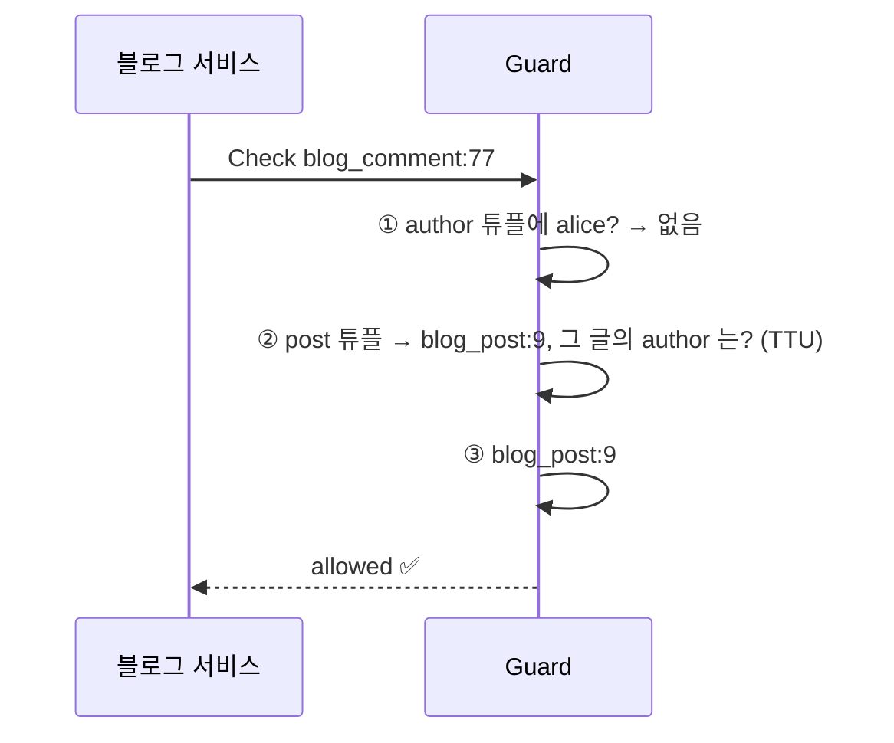
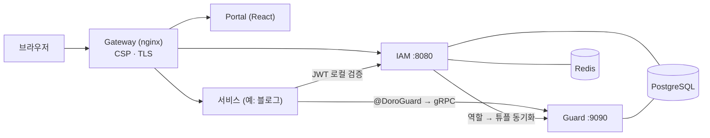

# 🛡️ Doro — Identity & Authorization Platform

> **English summary** — Doro is an identity and authorization platform I built so that every microservice I run shares **one account system** and **one permission engine**. The centerpiece is **Guard, a relationship-based access control (ReBAC) engine that I implemented from scratch, modeled on Google's Zanzibar**: permissions are stored as relation tuples and evaluated against a declarative schema, with cycle protection, bounded depth, and *fail-closed* evaluation. Around it: an OAuth 2.1 / OIDC identity provider (Argon2id, TOTP 2FA, refresh-token rotation with reuse detection), a Spring Boot SDK that lets a service delegate auth with one annotation, and a CI pipeline that runs 450+ tests before every deploy. Java 25 · Spring Boot 4 · PostgreSQL · Redis · gRPC · React.

여러 마이크로서비스가 **하나의 계정 체계**와 **하나의 권한 엔진**을 공유하도록 만든 인증·인가 플랫폼입니다.
서비스는 로그인도, 권한 검사도 직접 만들지 않고 SDK의 어노테이션 한 줄로 위임합니다.

```java
@DoroGuard("blog_post:#postId#editor")        // 이 글을 수정할 수 있는 사람만
public PostResponse update(@PathVariable Long postId, ...) { ... }
```

| | |
|---|---|
| **🧭 Guard** | 구글 **Zanzibar** 모델을 참고해 직접 구현한 관계 기반 인가(ReBAC) 엔진 ⭐ |
| **🔐 IAM** | OAuth 2.1 / OIDC 인증 서비스: Argon2id, TOTP 2FA, 토큰 회전과 재사용 탐지 |
| **🧩 SDK** | 서비스가 인증·인가를 위임받는 Spring Boot 라이브러리 |
| **📊 규모** | 테스트 **450+개**(auth 200+ · guard 100+ · sdk 80+ · web 60+), 모든 배포는 테스트 통과 후 |

---

## ⭐ Guard — 권한을 `if`문이 아니라 데이터로 다루기

### 왜 만들었나
`if (user.role == ADMIN || post.author == user)` 같은 권한 코드는 서비스가 늘수록 곳곳에 흩어지고, 규칙이 바뀔 때마다 모든 서비스를 고쳐야 합니다. 구글은 이 문제를 **"누가 무엇과 어떤 관계인가"를 데이터(튜플)로 저장하고, 규칙은 스키마로 선언**하는 Zanzibar로 풀었습니다. 저는 이 모델을 직접 구현해 제 서비스들의 권한 판단을 한곳으로 모았습니다.

### 예시: "블로그 댓글을 지울 수 있는 사람은?"
댓글 작성자 **또는 그 댓글이 달린 글의 작성자**입니다. 코드에 분기문을 쓰지 않고 스키마 한 줄로 선언합니다.

```text
type blog_comment {
  relation author: user
  relation post: blog_post
  relation can_delete: author | post#author      # 작성자 ∪ (달린 글의 작성자)
}
```



저장되는 데이터는 `blog_comment:77#post@blog_post:9`, `blog_post:9#author@user:alice` 같은 **튜플**뿐입니다. 규칙(스키마)이 바뀌어도 서비스 코드는 그대로입니다.

### 직접 설계하고 검증한 것
| 문제 | 해결 | 검증 |
|---|---|---|
| **순환 참조** (그룹이 그룹을 포함) 로 판정이 끝나지 않는다 | 경로별 방문 집합 + 최대 깊이(기본 32). 초과·순환 가지는 거부로 처리 | 3중 순환·자기 순환·상호 순환 테스트가 0.5초 안에 종료 |
| **차집합(`a - b`)** 에서 `b` 평가가 잘리면 "허용"이 될 수 있다 | `b`가 잘리면 전체를 **거부(fail-closed)**, 불완전한 결과는 **캐시하지 않음** | 잘린 평가·차집합 전용 테스트 |
| 권한 변경 직후 **낡은 캐시**가 허용을 내준다 | 튜플이 실제로 바뀐 경우에만, **커밋 이후** 캐시를 비움. 평가 도중 무효화가 겹치면 그 결과는 저장하지 않음(세대 카운터) | 쓰기·삭제·스키마 변경 시 무효화 테스트 |
| 같은 튜플을 **동시에** 쓰면 중복·충돌이 난다 | `INSERT … ON CONFLICT DO NOTHING`과 부분 유니크 인덱스로 멱등 처리 | 같은 튜플을 20스레드가 동시에 쓰면 정확히 1행(PostgreSQL), 동시 Check 부하 테스트(20스레드 × 50회) |
| 서비스마다 스키마를 올리면 **서로 덮어쓴다** | 서버는 스키마를 **통째로 교체**하므로, 각 서비스가 활성 스키마를 받아 **자기 타입만 병합해 올리는 절차**를 따릅니다(문서화, 서비스별 병합기). 서버는 호출자별 서비스 토큰과 `schema-write` 권한, 버전 관리와 핫 리로드(주기 갱신), 다중 인스턴스 간 단조 증가 버전 동기화를 제공 | 서비스별 병합기 테스트 |
| 스키마 **오타**가 조용히 통과한다 | 스키마 등록 시 미선언 타입·앞선 참조를 진단하고, 튜플 쓰기는 선언된 타입·관계만 허용. 검증 모드 `OFF` / `WARN`(기본) / `ENFORCE`, `ENFORCE`에서 거부 | 실제 서비스 스키마로 진단 0건 확인 |
| "이 문서를 볼 수 있는 모든 사람은?" | **Expand** API: 권한 트리를 노드 수 상한과 함께 전개 | gRPC 테스트 |

- 연산자: 합집합 `|`, 교집합 `&`, 차집합 `-`, 상속 `x#y`(Tuple-to-Userset), 그룹 멤버십(userset)
- 인터페이스: **gRPC**(서비스용)와 REST, 판정 결과에 도달 깊이를 함께 반환
- 실제 사용처: 제 블로그 서비스([doro-blog](https://github.com/yu-teacher/doro-blog))가 글·시리즈·댓글 권한 전부를 Guard에 위임합니다.

---

## 🔐 IAM — 인증

- **비밀번호** Argon2id, 5회 실패 시 15분 잠금, 엔드포인트별 IP 요청 제한
- **2단계 인증** TOTP(RFC 6238). 등록은 "대기 → 검증 → 활성화" 2단계라 중간에 중단해도 계정이 잠기지 않음
- **토큰** RS256 JWT(15분)와 30일 리프레시 토큰. 리프레시는 **쓸 때마다 회전**하고, 이미 쓴 토큰이 다시 오면 **탈취로 판단해 해당 세션 전체를 종료**
- **OAuth 2.1 / OIDC** 인가 코드 + PKCE, 클라이언트 등록, `id_token`, `userinfo`. OAuth로 발급한 토큰은 역할이 `USER`로 고정돼 관리자 권한을 가져가지 못하고, IAM 자신의 API 중 `userinfo`와 현재 세션 조회에만 쓸 수 있도록 **격리**
- 서비스는 IAM에 매번 묻지 않고 **공개키(JWKS)로 로컬에서 서명을 검증**합니다. 로그아웃을 즉시 반영하고 싶은 서비스는 세션 확인을 옵션으로 켤 수 있습니다.

## 🧩 SDK — 서비스에 붙이는 법

```groovy
implementation 'com.hunnit-beasts:doro-sdk'
```
```yaml
doro:
  iam:   { jwks-uri: http://auth-api:8080/.well-known/jwks.json }
  guard: { grpc-host: guard-api, grpc-port: 9090 }
```
`@DoroGuard`(SpEL 지원), `@CurrentDoroUser`, 튜플 동기화용 `DoroGuardClient`를 제공합니다. Guard가 응답하지 않으면 **거부**로 처리합니다(fail-closed).

---

## 🏗️ 구조


IAM(`doro_auth`)과 Guard(`doro_guard`)는 각자 DB를 쓰고, 서브 서비스마다 **독립 DB**(`service_{name}`)를 씁니다. 스키마 변경은 모두 Flyway 마이그레이션으로 관리합니다.

## ⚙️ 운영 품질
- **CI** `main` 푸시마다 컨테이너 안에서 백엔드·웹 테스트를 돌리고, **통과해야 배포**합니다.
- **관측성** 모든 로그를 stdout으로 내보내 서버별 수집기(Grafana Alloy) → 중앙 Loki → Grafana로 수집, `traceId`를 HTTP와 SDK → Guard gRPC로 전파합니다.
- **보안 기본기** 게이트웨이 CSP, 서비스 간 호출자 토큰, 시크릿 로그 금지, 입력 검증, 업로드·XSS 방어(블로그).

## 🚀 실행
```bash
cp .env.example .env     # POSTGRES_PASSWORD 설정
docker compose up -d     # Postgres · Redis · IAM · Guard · Portal
./gradlew test           # auth · guard · sdk 전체 테스트
```

## 🧰 기술 스택
Java 25 · Spring Boot 4.1 · PostgreSQL 16 · Redis 7 · gRPC/Protobuf · Flyway · Caffeine · React 19 · Vite · nginx · Docker Compose · GitHub Actions

## 📚 더 읽기
| | |
|---|---|
| [사용자 가이드](docs/USER_GUIDE.md) | 가입부터 OAuth, Guard 스키마, SDK까지 따라 하기 |
| [연동 가이드](docs/DORO_AGENT_GUIDE.md) | 실제 동작, 보안 구성, 검증 명령 |
| [게이트웨이 규칙](docs/GATEWAY_ROUTING_RULES.md) | 라우팅 규칙과 새 서비스 추가 |
